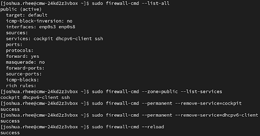
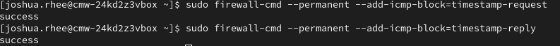

## ICMP Timestamp and Service Hardening

Date: June 4, 2025  
Target: Rocky Linux (10.0.3.10)  
Focus: Firewall tightening and service reduction

### Removed Unnecessary Services

Reviewed exposed services using:

```bash
sudo firewall-cmd --zone=public --list-services
```

Removed unused services:

```bash
sudo firewall-cmd --permanent --remove-service=cockpit
sudo firewall-cmd --permanent --remove-service=dhcpv6-client
sudo firewall-cmd --reload
```



---

### Blocked ICMP Timestamp Requests and Replies

To reduce passive fingerprinting and time-based attack risk, I blocked ICMP timestamp traffic:

```bash
sudo firewall-cmd --permanent --add-icmp-block=timestamp-request
sudo firewall-cmd --permanent --add-icmp-block=timestamp-reply
sudo firewall-cmd --reload
```



---

### Result

A follow-up scan showed only SSH (port 22) remained accessible:


