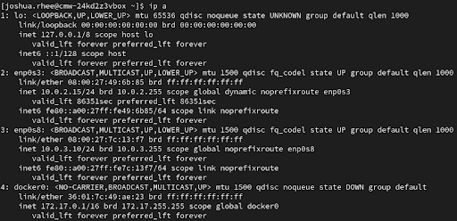
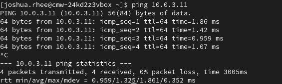
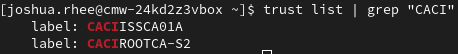

# Virtual Lab Setup & CA Integration – Notes

## VM Environment Setup

This summer, I built out a virtual lab using VirtualBox to support cybersecurity automation and testing. I set up four main VMs:

- **Kali Linux** – for offensive testing  
- **Rocky Linux** – hardened baseline server  
- **Nessus** – external vulnerability scanner  
- **VulnHub VMs** – targets for testing  

To simulate an isolated but functional network, I used a mix of:

- **Internal Network (`intnet`)** for private communication  
- **NAT** for internet access  

To avoid network issues with DNS and policies, I manually set static IPs for each VM to keep connections stable and known:

```
Kali:   10.0.3.12  
Nessus: 10.0.3.11  
Rocky:  10.0.3.10  
```
### Connectivity Tests

Some basic commands I used to validate connectivity:

- `ip a`
- `ping 10.0.3.11`
- `nmcli dev show`
---
**Static IP assignment on Rocky**  


**Ping from Rocky to Nessus**  


---

## Proxy & Network Adjustments

Because of internal policies, HTTPS traffic was intercepted, triggering errors like:

- `ERR_CERT_AUTHORITY_INVALID`  
- `SSL_ERROR_BAD_CERT_DOMAIN`  

### Installing Internal CA Certificates

To fix this, I exported and installed the root and intermediate CAs:

- `CACIROOTCA-S2.pem`  
- `CACIISSCA01A.pem`  

**Linux trust store (system-wide):**

```bash
sudo trust anchor CACIROOTCA-S2.pem
sudo update-ca-trust extract
```
Adds the certificate to the system trust store to enable commands like `curl`, `dnf`, and others.

**Browser trust setup:**

- **Chrome:** `certutil` with `~/.pki/nssdb`
- **Firefox:** Used system trust or manual import

Adds the cert to local databases so it trusts internal sites.

To verify success:

```bash
trust list | grep "CACI"
```

**Screenshot – CA verification using trust list**  


After importing, I could securely access internal tools and dashboards inside both **Firefox** and **Chrome**.

---

## Snapshot Management

- Took initial VM snapshots once lab was configured 
- Ensured revert functionality worked 

---

## End Result

- Secure browser sessions with trusted internal CA  
- SSL errors fully resolved across all VMs  
- Automation and scanning unblocked (Nessus, Chrome dashboards)  
- Snapshots enabled safe testing and rollback 
