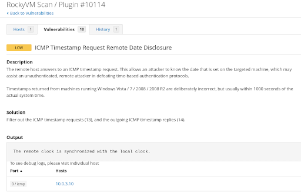
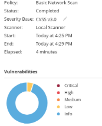
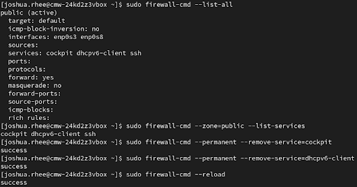
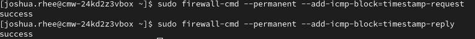
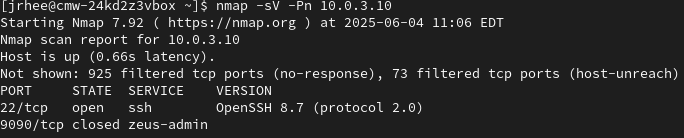
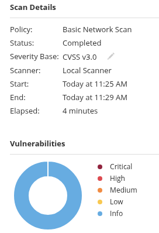

## ICMP Timestamp Vulnerability – Discovery, Hardening, and Validation

### Tool: Nessus  
### Target: Rocky Linux (10.0.3.10)

Nessus reported that the Rocky VM responded to ICMP timestamp requests, exposing system time and increasing the risk of time-based attacks.

 

To minimize the attack surface, I reviewed open firewall services:

```bash
sudo firewall-cmd --zone=public --list-services
```

Unnecessary services like `cockpit` and `dhcpv6-client` were removed:

```bash
sudo firewall-cmd --permanent --remove-service=cockpit
sudo firewall-cmd --permanent --remove-service=dhcpv6-client
sudo firewall-cmd --reload
```



ICMP timestamp requests and replies were blocked via firewall:



To validate the fix externally, I scanned the target using Nmap:

```bash
nmap -sV -Pn 10.0.3.10
```

Only SSH (port 22) remained open.



A final Nessus re-scan confirmed that the ICMP timestamp vulnerability was resolved.


